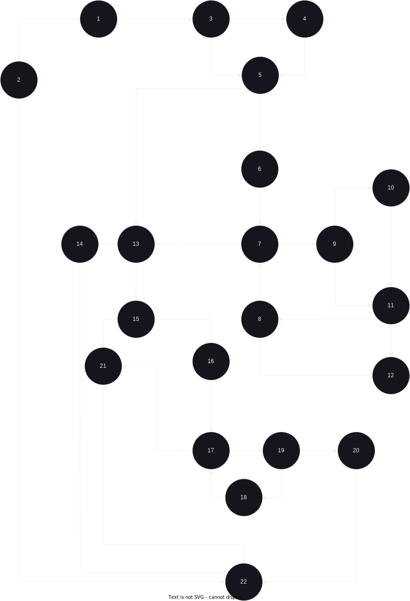

Damjan Boshkovski, 215048

1. Control Flow Graph

2. Цикломатска комплексност
Цикломатската комплексност на овој код е 11, тој број го добив преку формулата V = E - N + 2P, каде што E (31) е бројот на рабови, N (22) е бројот на јазли, а P (1) е бројот на предикатни јазли,

3. Напишете ги сите тест случаи според Every Branch критериумот. Напишете и објаснете ги тест случаите во документацијата
	- Доколку username, password и email се внесени тогаш излезот треба да е: true
	- Доколку username, password и email не се внесени тогаш излезот треба да е: RuntimeException("Mandatory information missing!");
	- Доколку username не е внесено треба email-от да биде ставен како username
	- Доколку password-от го содржи username-от или должината е помала од 8 карактери излезот треба да е: false
	- Доколку email-от не содржи '@' и '.' излезот треба да е: false
	- Доколку email-от веќе се користи за друг username излезот треба да е: false

4. Напишете ги сите тест случаи според Multiple Condition критериумот за условот if (user==null || user.getPassword()==null || user.getEmail()==null). Напишете и објаснете ги тест случаите во документацијата.

	- Во случајот каде што сите полиња се null излезот треба да е: RuntimeException("Mandatory information missing!");
	- Во случајот каде што email-от не содржи '@' и '.' излезот треба да е: false
	- Во случајот каде што password-от е помал од 8 карактери и содржи специјални карактери излезот треба да е: false
	- Во случајот каде што сите полиња се точно пополнети излезот треба да е: true

